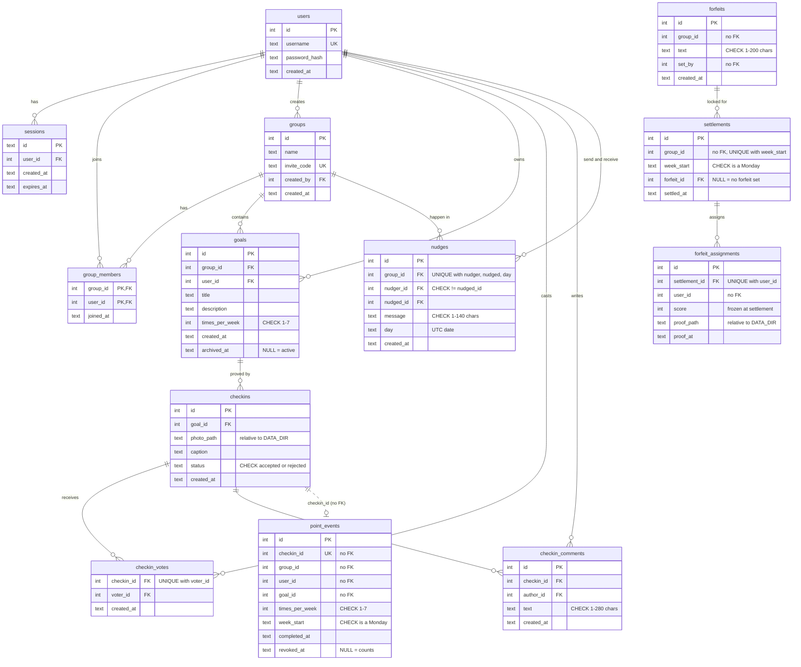

# Architecture Decision Records

## 1. Backend language/framework: Python with FastAPI
Date: 2026-09-28
Status: Decided
Context: The app needs a small JSON API (auth, groups, photo check-ins, weekly points) running as a single process on SQLite, and I have to be able to explain every line of it closed-book.
Decision: Use Python with FastAPI, served by uvicorn, with raw SQL through the standard-library sqlite3 module.
Alternatives considered: Django, rejected because it is too heavy for this app: its ORM, migrations and admin panel solve problems I don't have with a handful of SQLite tables, and would add framework code I'd need to understand and justify. Flask, rejected because it has no built-in request validation or automatic API docs, so I'd need extra libraries for what FastAPI gives me through Pydantic models and /docs.
Consequences: I work in the language I know best and keep the dependency list short (fastapi + uvicorn); in exchange I write my own SQL and schema setup instead of getting them from a framework.

## 2. Scoping the two feature domains to be independently modularizable
Date: 2026-09-29
Status: Decided
Context: The app runs as one process now but should be splittable into services later. Goals & Check-ins and Points & Forfeits both need user/group data and photos, which would easily tangle them together through shared tables.
Decision: Each domain owns its tables and exposes a service layer; other code may call a domain's service functions but never query its tables. Both domains ask auth only through auth.service functions (e.g. is_member, list_members), check-ins notifies Points only through points.service.record_completion/revoke_completion, and photo handling lives in shared/uploads.py so neither domain imports the other for it.
Alternatives considered: Letting app/checkins/repository.py query group_members directly (simpler, one JOIN). Rejected because it couples Check-ins to auth's table layout, so a service split would mean rewriting SQL instead of replacing one function with an HTTP call. A separate SQLite file per domain was also rejected: the spec requires one SQLite file at one path, and it would lose cross-domain transactions immediately rather than at split time.
Consequences: A future split mostly changes the seam functions, plus dropping the cross-domain foreign keys (goals → users/groups) and handling what one SQLite transaction currently gives for free: a check-in and its point event being written together. Day to day, it costs cross-domain JOINs: the goals list returns user_id rather than username, and some checks need extra queries.

## 3. Data model: soft-archived goals, and a points ledger linked to check-ins by id only
Date: 2026-10-01
Status: Decided
Context: Check-ins and their points must keep pointing at the goal and check-in they came from even after a goal is archived or a check-in is rejected, and there is no migration tool, so columns later phases need must exist from the start. Points also needs per-check-in data without reading the check-ins tables (ADR-2).
Decision: Goals are soft-archived (archived_at), and a check-in stores only goal_id, a photo path relative to DATA_DIR and a status column for voting, with its group and owner derived by a same-domain JOIN. Points keeps a ledger, point_events, with one row per check-in (UNIQUE checkin_id, revoked_at on rejection) that holds other domains' ids without foreign keys, and weekly scores and streak bonuses are computed from it in SQL rather than stored; only a settled week is stored (settlements, forfeit_assignments), because it must not change once final.
Alternatives considered: Hard-deleting goals with ON DELETE CASCADE, rejected because it would erase check-ins and their points. Storing weekly totals per member, rejected because incrementing is not idempotent and a rejection could not free a capped slot, rescore a past week or end a streak without recounting. Foreign keys from point_events to check-ins, rejected because they tie Points to the check-ins schema and would have to be dropped in a split.
Consequences: History survives archiving and rejection, scoring a check-in twice is impossible at the database level, and rankings and streaks always match the events. In exchange, every leaderboard read recomputes two weeks with window functions, and the database cannot stop point_events from holding an id that does not exist in another domain.

Diagram for ADR-3 (solid lines are foreign keys; the dotted line is the domain seam, an id with no foreign key, written only through points.service.record_completion):

## 4. Testing approach: pure rules and services against a real temporary SQLite, routes checked end to end
Date: 2026-10-03
Status: Decided
Context: The assignment asks for at least 70% coverage of core business logic, and the riskiest code is where rules meet the database: scoring a check-in only once, rejecting and settling exactly once under concurrent requests, and week boundaries. Mocking the database would fake exactly the SQL constraints those guarantees rely on.
Decision: Business rules are pure functions tested with plain values and an explicit `now`, and every service is tested against a fresh SQLite file in pytest's tmp_path (the real schema from init_db, never the real database), including a two-connection race on settlement. Coverage is measured on core logic only (services, rules, repositories, config, shared modules), with the thin routes.py files excluded in .coveragerc.
Alternatives considered: Route tests through FastAPI's TestClient, rejected because they need httpx as a new dependency and would mostly test framework glue; the routes were checked with end-to-end runs against a real server instead. Mocking the repository layer, rejected because the guarantees live in UNIQUE, CHECK and conditional UPDATE statements that a mock would only pretend to have.
Consequences: Core logic is at 99%, with tests that exercise the real constraints and a real race, so the 70% bar is met with a wide margin. In exchange the HTTP layer (request parsing, status-code mapping) has no automated tests, so a mistake there would only show up in a manual or end-to-end run.

## 5. Deliberately not built: voting on forfeit proof
Date: 2026-10-02
Status: Decided
Context: A forfeit loser uploads photo proof, and check-ins already let the group vote to reject a suspicious photo, so the same could be built for proof. Points must stay independent of the check-ins domain, and the deadline left little time.
Decision: Proof is accepted as uploaded: only the assigned member can upload it, once, and every group member can see it, but nobody can vote it down.
Alternatives considered: Reusing the check-in rejection vote for proof, rejected because Points would either depend on check-ins' voting code or duplicate it, and a second 48h window would delay when a forfeit counts as done. A point penalty for missing proof, rejected so that scoring stays independent of forfeits.
Consequences: A loser could upload an unrelated photo; the group sees it and deals with it socially, as with goal farming in Phase 2a. Proof voting can be added later as a new table and endpoint inside Points without changing existing tables.
